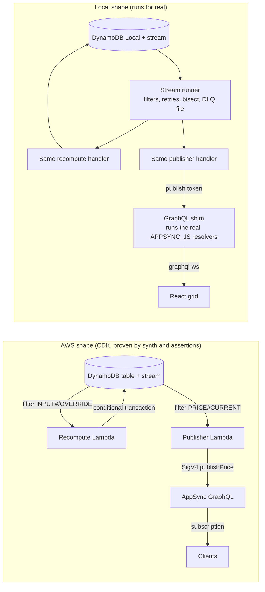

# pricing-engine

**p99 735 ms from input change to live subscriber at 5 updates/s, 0 lost of 300** (local pipeline: DynamoDB Local + stream runner + GraphQL shim, 2026-10-04; [method](docs/adr/0007-measured-headline-benchmark.md)).

A stream-driven pricing engine. An input write (cost, competitor price, stock) lands in DynamoDB, a stream handler re-evaluates a JSON rule set, writes the new price once, and pushes it to subscribers over GraphQL. The rule engine is a separate pure package, `pricing-rules-core`, with integer money, a decision trace for every price, and property tests.

## 30-second demo

```bash
pnpm install
pnpm demo            # docker compose: DynamoDB Local, GraphQL shim, stream runner, simulator, web
# open http://localhost:5362 for the live grid
pnpm watch           # or follow the ticks in the terminal
pnpm demo:down
```

Real output of `pnpm watch --seconds 10` against the compose demo:

```
23:39:11.289  SKU-0023  8.99 EUR    v7
23:39:12.373  SKU-0021  8.99 EUR    v8
23:39:13.020  SKU-0008  9.99 EUR    v5
```

Host ports used: 5360 (DynamoDB Local), 5361 (GraphQL), 5362 (web).

## Architecture



The handlers and resolvers are the same code in both shapes. Only the delivery layer differs: Lambda event source mappings on AWS, a small runner locally.

## What is proven, and how

| Invariant | Test |
| --- | --- |
| A price is always inside `[floor, ceiling]` | [`bounds.property.test.ts`](packages/core/test/bounds.property.test.ts) (fast-check, 10,000 runs) |
| The step limit holds whenever the step band meets the price band | [`step-limit.property.test.ts`](packages/core/test/step-limit.property.test.ts) |
| The configured price ending is applied when one fits | [`ending.property.test.ts`](packages/core/test/ending.property.test.ts) |
| Same request with shuffled keys gives the same decision | [`determinism.property.test.ts`](packages/core/test/determinism.property.test.ts) |
| Rounding follows the HALF_EVEN and HALF_UP tables | [`money.table.test.ts`](packages/core/test/money.table.test.ts) |
| Expired overrides do nothing; active ones are clamped | [`override.test.ts`](packages/core/test/override.test.ts) |
| `core` cannot use `Date`, `Math.random` or `parseFloat` | [`purity-lint.test.ts`](packages/core/test/purity-lint.test.ts) |
| A stale computation never overwrites a newer price | [`concurrency.int.test.ts`](packages/functions/test/concurrency.int.test.ts) (DynamoDB Local) |
| Replaying a batch three times adds no history and no publish | [`replay.int.test.ts`](packages/functions/test/replay.int.test.ts), [`publisher.test.ts`](packages/functions/test/publisher.test.ts) |
| Resolvers use only APPSYNC_JS syntax | `pnpm lint` with the AppSync ESLint plugin on `packages/api/resolvers` |
| `publishPrice` is IAM only; money fields are `Int` | [`schema.test.ts`](packages/api/test/schema.test.ts), [`appsync.test.ts`](infra/test/appsync.test.ts) |
| Every event source mapping has bisect, 3 retries, partial failures, a DLQ and a filter | [`esm.test.ts`](infra/test/esm.test.ts) |
| No IAM action contains `*` | [`iam.test.ts`](infra/test/iam.test.ts) |
| cdk-nag AwsSolutions passes with documented acknowledgements | [`nag.test.ts`](infra/test/nag.test.ts), `pnpm synth` |
| The shim rejects `publishPrice` without the publish token | [`shim.int.test.ts`](packages/local/test/shim.int.test.ts) |
| Nothing lost, no price outside its band, in the benchmark | `pnpm bench` exits non-zero otherwise |
| This headline equals `bench/results/latest.json` | `node scripts/check-readme-headline.mjs` |

## Install the rule engine

`pricing-rules-core` is publish-ready (`pnpm --filter pricing-rules-core pack:check`) but not yet published.

```ts
import { evaluate, validateRuleSet } from 'pricing-rules-core';

const checked = validateRuleSet(ruleSetJson);
if (!checked.ok) throw new Error(checked.errors.map((e) => `${e.pointer} ${e.message}`).join('\n'));
const decision = evaluate({ inputs: { COST: { value: 1000, seq: 1 } }, ruleSet: checked.ruleSet, now: Date.now() });
```

More in [packages/core/README.md](packages/core/README.md).

## Numbers

Both come from files the benchmark commands wrote. Re-run them to compare on your machine.

**Pipeline latency** ([`bench/results/latest.json`](bench/results/latest.json)): input write to subscriber message, 100 SKUs, 5 updates/s for 60 s, runner poll 250 ms.

| Metric | Value |
| --- | --- |
| p50 | 333.6 ms |
| p95 | 630.4 ms |
| p99 | 734.8 ms |
| max | 846.2 ms |
| samples / superseded / lost / mismatches / invariant violations | 300 / 0 / 0 / 0 / 0 |
| achieved send rate | 5.01 updates/s |

"Superseded" means a newer version of the same SKU was priced and published instead of this one (the recompute handler prices the latest stored state, ADR 0004). "Lost" means nothing newer arrived within 10 s. Only lost, mismatches and violations fail the run.

Machine: AMD Ryzen 9 7900X 12-Core Processor, win32, Node v24.18.0, DynamoDB Local 3.3.1 in Docker.

**Rule engine** ([`bench/results/core-latest.json`](bench/results/core-latest.json)): `evaluate()` over 100,000 calls on the same machine: 1,571,376 calls/s, p50 0.5 us, p99 1.5 us.

## Honest limits

- This is the local pipeline, not AWS. The number excludes network hops and cold starts, and includes DynamoDB Local on a laptop.
- AppSync, Cognito and the Lambda event source mappings are proven by `cdk synth`, assertions and cdk-nag, not by a deployment. Nothing was deployed.
- The benchmark runs at 5 updates/s, not 50. On the build machine DynamoDB Local serialized transactional writes on a stream-enabled table, so higher rates queue: p50 was 1.8 s at 20 updates/s and 7.0 s at a nominal 50 updates/s (achieved 34.6/s), with 0 lost and 189 of 500 updates superseded (see [ADR 0007](docs/adr/0007-measured-headline-benchmark.md) and the 2026-10-04 files in `bench/results/`). The result file is the only source for the headline.
- Latency depends on machine load. Runs made while the host CPU was saturated measured p50 from 1.5 s to 18 s with the same code; the committed `latest.json` is the last run. The timestamped files in `bench/results/` keep the earlier runs.
- Deferred to v0.2: OpenSearch indexer and search, rule-set editor and activation, a `setOverride` mutation, category subscriptions, a real AWS deploy and latency run.

## Decisions

- [0001 Local pipeline without LocalStack](docs/adr/0001-local-pipeline-without-localstack.md)
- [0002 Integer money and rounding](docs/adr/0002-integer-money-and-rounding.md)
- [0003 Evaluation pipeline and precedence](docs/adr/0003-evaluation-pipeline-and-precedence.md)
- [0004 Recompute from state with a version token](docs/adr/0004-recompute-from-state-with-version-token.md)
- [0005 Publisher and auth](docs/adr/0005-publisher-and-auth.md)
- [0006 Prebundled Lambdas and cdk-nag](docs/adr/0006-prebundled-lambdas-and-cdk-nag.md)
- [0007 Measured headline benchmark](docs/adr/0007-measured-headline-benchmark.md)

## License

MIT
