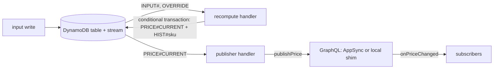

# pricing-engine developer guide

## 1. What it is

A stream-driven pricing engine. Input changes in DynamoDB trigger a recompute, the new price is written once with a version check, and subscribers get it over GraphQL. The rule engine (`pricing-rules-core`) is pure and publishable.

Measured headline (from `bench/results/latest.json`): p99 2194 ms from input change to live subscriber at 5 updates/s, 0 lost of 300 samples (p50 172.5 ms). This is the local pipeline (DynamoDB Local + stream runner + GraphQL shim), not AWS.

## 2. Quickstart (5 minutes)

Needs Node 24, pnpm 9.12 and Docker.

```bash
pnpm install --frozen-lockfile
pnpm demo                      # compose: DynamoDB Local, shim, runner, simulator, web
curl -s -X POST http://127.0.0.1:5361/graphql -H "content-type: application/json" \
  -d '{"query":"{ price(sku: \"SKU-0001\") { sku priceMinor currency inputsVersion } }"}'
open http://localhost:5362     # live grid
pnpm watch --seconds 10        # terminal ticks
pnpm demo:down
```

Without compose: `docker compose up -d dynamodb`, then `pnpm dev` (table, seed, shim, runner in one process) and `pnpm local sim --rate 5` in another shell.

## 3. Architecture



On AWS the arrows out of the stream are Lambda event source mappings (filters, 3 retries, bisect, partial batch failures, SQS DLQ). Locally `packages/local` emulates those semantics. The write token is the pair `(inputsVersion, ruleSetVersion)`; a write whose pair is not newer is rejected by a DynamoDB condition and counted as `STALE`.

Evaluation order: base price, rules in order, active override, clamp to the band (and step band), price ending. The band beats the step limit, which beats the ending (ADR 0003).

## 4. Project layout

| Path | Contents |
| --- | --- |
| `packages/core` | `pricing-rules-core`: money, rule-set schema, `evaluate()`, property tests, micro-benchmark |
| `packages/functions` | recompute and publisher handlers, DynamoDB store, AppSync SigV4 publisher, Lambda bundles |
| `packages/api` | GraphQL schema and APPSYNC_JS resolvers, util shim for local runs |
| `packages/local` | stream runner, GraphQL shim, CLI (`table`, `seed`, `up`, `sim`, `override`, `watch`), latency benchmark |
| `packages/web` | React + Vite live price grid |
| `infra` | CDK stack, cdk-nag acknowledgements, assertion tests |
| `bench/results` | benchmark output; the README headline is checked against `latest.json` |
| `docker/`, `docker-compose.yml` | demo image and compose file (containers `pricing-engine-*`) |
| `docs/adr` | decision records 0001 to 0007 |

## 5. Run, test and benchmark

```bash
pnpm lint
pnpm typecheck
pnpm test                 # unit + properties (10,000 runs each); no Docker, network or AWS
pnpm synth                # esbuild bundles + cdk synth with cdk-nag AwsSolutions
pnpm --filter pricing-rules-core pack:check
docker compose up -d dynamodb
pnpm test:int             # DynamoDB Local integration tests
pnpm bench                # writes bench/results/latest.json; exits 1 on any loss
pnpm bench --duration 10 --no-latest   # smoke run
pnpm bench:core           # evaluate() micro-benchmark
node scripts/check-readme-headline.mjs
```

Ports: 5360 DynamoDB Local, 5361 GraphQL, 5362 web, 5363 bench shim. Override the table, endpoint and token with `PRICING_TABLE`, `PRICING_DDB_ENDPOINT`, `PRICING_GQL_URL`, `PRICING_PUBLISH_TOKEN` (the default `local-dev-only` is not a secret).

Rule: every writer of input items must keep the `seq` condition (`attribute_not_exists(SK) OR seq < :seq`). The recompute path relies on it (ADR 0004).

## 6. Key decisions and what they gave up

- No LocalStack ([0001](adr/0001-local-pipeline-without-localstack.md)): the local pipeline is DynamoDB Local + runner + shim, so AppSync itself is only proven by synth and assertions.
- Integer money, `factorBps` instead of float multipliers ([0002](adr/0002-integer-money-and-rounding.md)): no floats in rule sets.
- Fresh base price per evaluation, band over step over ending ([0003](adr/0003-evaluation-pipeline-and-precedence.md)): no "momentum" pricing.
- Recompute from stored state with a version-pair token and history under `HIST#<sku>` ([0004](adr/0004-recompute-from-state-with-version-token.md)): a transaction per price costs write throughput.
- Publisher at-least-once, IAM-only `publishPrice`, local publish token ([0005](adr/0005-publisher-and-auth.md)).
- Prebundled Lambdas and a cdk-nag gate ([0006](adr/0006-prebundled-lambdas-and-cdk-nag.md)).
- Headline from `pnpm bench` ([0007](adr/0007-measured-headline-benchmark.md)). The default rate is 5 updates/s because higher rates queue on DynamoDB Local (probably its serialized transactional writes; not isolated): at 20/s p50 was 1.8 s and at a nominal 50/s p50 was 7.0 s with 0 lost and 189 of 500 updates superseded. A superseded update is one replaced by a newer version of the same SKU before it was priced, which is by design.

cdk-nag acknowledgements (`infra/src/nag-acknowledgements.ts`): AWS managed policies on the two function roles, the LogRetention helper and the AppSync log role (IAM4); the LogRetention helper wildcard and the table `/index/*` for the AppSync data source (IAM5); optional MFA and no Plus plan on the demo user pool (COG2, COG8); no DLQ for the DLQs (SQS3).

## 7. Known limits and what is left

- Local pipeline only. Nothing was deployed to AWS; AppSync, Cognito and the event source mappings are proven by synth and assertions.
- Latency depends on machine load: runs on a saturated host measured p50 from 1.5 s to 18 s. Re-run `pnpm bench` on a quiet machine. The current p99 (2194 ms) is a tail on a shared host; the median of the same run is 172.5 ms.
- The web grid has unit tests and was smoke-checked over HTTP (status 200), but nobody has looked at it in a browser yet.
- Overrides: an override's expiry emits no stream event, so the price stays at the override value until some input of that SKU changes. Create one with `pnpm local override --sku SKU-0001 --price 799 --minutes 5`.
- Deleting an `INPUT#` or `OVERRIDE` item lowers `inputsVersion` (the sum of the `seq` values), so later recomputes are STALE until the sum climbs back. Do not delete them; write a higher `seq` instead.
- Money and version fields are GraphQL `Int` (32 bit, at most 2,147,483,647, about 21.4M EUR in minor units). Larger values are rejected by GraphQL validation, locally and on AppSync, although `pricing-rules-core` accepts up to 1e12.
- The benchmark counts a missing update as `superseded` when a newer version of the same SKU arrived, and as `lost` otherwise. Only `lost`, mismatches and invariant violations fail it.
- v0.2: OpenSearch indexer and search, rule-set editor and activation, `setOverride` mutation, category subscription, real AWS deploy, AWS latency run.
